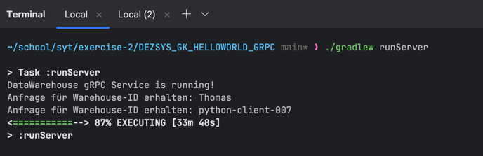
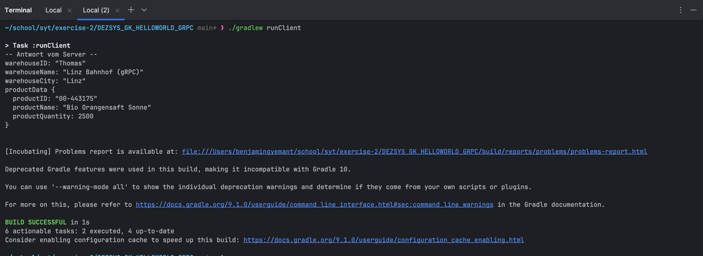
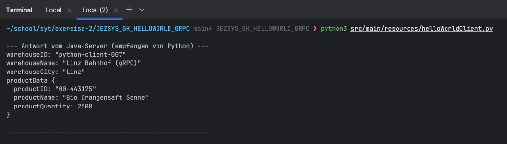

# DEZSYS_GK72_DATAWAREHOUSE_GRPC - Dokumentation

Benjamin Gyemant
21.10.2025

Dieses Projekt demonstriert die Verwendung des gRPC Frameworks, um einen sprachübergreifenden Remote Procedure Call (RPC) zwischen einem Java-Server und Clients in Java und Python zu implementieren.

## Theoretische Grundlagen

#### Was ist gRPC und warum funktioniert es sprach- und plattformübergreifend?

gRPC ist ein von Google entwickeltes Framework für Remote Procedure Calls (RPC). Statt wie bei REST mit URLs und JSON-Dokumenten zu arbeiten, kann ein Client damit direkt Funktionen auf einem Server aufrufen, als wären sie lokal.

Es funktioniert sprachübergreifend, weil es auf **Protocol Buffers** (`.proto`-Dateien) als "Vertrag" setzt. Aus einer einzigen `.proto`-Datei kann man Code für verschiedenste Sprachen (Java, Python, Go etc.) generieren. Dieser Vertrag ist die gemeinsame Sprache, die alle verstehen.

#### Beschreibe den RPC-Lebenszyklus aus Sicht des Clients.

1.  **Client ruft Funktion auf:** Der Client ruft eine Methode auf einem lokalen "Stub"-Objekt auf.
2.  **Serialisierung:** Die gRPC-Bibliothek packt die Funktions-Parameter in eine kompakte, binäre Protocol-Buffer-Nachricht.
3.  **Versand:** Die Nachricht wird über das Netzwerk an den Server geschickt.
4.  **Empfang & Deserialisierung:** Der Server empfängt die Nachricht, packt sie aus und ruft die eigentliche Implementierung der Funktion auf.
5.  **Verarbeitung:** Die Server-Logik wird ausgeführt und gibt ein Ergebnis zurück.
6.  **Rückweg:** Das Ergebnis wird wieder in eine Protocol-Buffer-Nachricht verpackt und an den Client zurückgeschickt, der sie ebenfalls auspackt und das Ergebnis an den ursprünglichen Aufrufer zurückgibt.

#### Beschreibe den Workflow von Protocol Buffers.

1.  **Definieren:** Man schreibt in einer `.proto`-Datei, welche Services es gibt und wie die Datenstrukturen (Messages) aussehen.
2.  **Kompilieren:** Der Protocol-Buffer-Compiler (`protoc`) liest die `.proto`-Datei und generiert daraus automatisch Klassen in der Zielsprache (z.B. Java oder Python).
3.  **Benutzen:** Im Code verwendet man diese generierten Klassen, um Datenobjekte zu erstellen, sie zu versenden und zu empfangen.

#### Was sind die Vorteile von Protocol Buffers?

*   **Effizienz:** Das binäre Format ist viel kleiner und schneller zu verarbeiten als textbasierte Formate wie JSON oder XML.
*   **Strikte Typisierung:** Der Vertrag in der `.proto`-Datei erzwingt klare Datenstrukturen und verhindert Fehler.
*   **API-Entwicklung:** Man kann Nachrichten einfach um neue Felder erweitern, ohne alte Clients oder Server kaputt zu machen.

#### Wann ist die Verwendung von Protocol Buffers nicht empfohlen?

Wenn die Daten direkt von Menschen gelesen oder bearbeitet werden müssen. Das Binärformat ist dafür nicht gedacht. Auch für klassische Web-Browser-Anwendungen ist es ohne zusätzliche Frameworks (wie gRPC-Web) nicht direkt nutzbar.

#### Nenne 3 verschiedene Datentypen, die mit Protocol Buffers verwendet werden können.

1.  `string` (für Text)
2.  `int32` (für 32-bit Ganzzahlen)
3.  `repeated` (für Listen/Arrays von einem anderen Typ)

---

## Implementierung

Das Ziel war es, das bestehende HelloWorld-Projekt so zu erweitern, dass es einen DataWarehouse-Datensatz übertragen kann.

### Schritt 1: Anpassung des Vertrags (`.proto`-Datei)

Die Basis jeder Änderung war die Anpassung der `hello.proto`. Der alte Inhalt wurde komplett durch eine neue Definition für unseren DataWarehouse-Service ersetzt.

**`src/main/proto/hello.proto` (Neuer Inhalt)**
```protobuf
syntax = "proto3";

option java_package = "grpc.datawarehouse";
option java_multiple_files = true;

service DataWarehouseService {
  rpc getWarehouseData(WarehouseRequest) returns (WarehouseData) {}
}

message WarehouseRequest {
  string warehouseID = 1;
}

message Product {
  string productID = 1;
  string productName = 2;
  string productCategory = 3;
  int32 productQuantity = 4;
  string productUnit = 5;
}

message WarehouseData {
  string warehouseID = 1;
  string warehouseName = 2;
  string warehouseAddress = 3;
  string warehousePostalCode = 4;
  string warehouseCity = 5;
  string warehouseCountry = 6;
  string timestamp = 7;
  repeated Product productData = 8; 
}
```
Nach dieser Änderung mussten mit `./gradlew clean build` die neuen Java-Klassen generiert werden.

### Schritt 2: Anpassung der Java-Implementierung

Die existierenden Java-Klassen mussten an den neuen Vertrag angepasst werden.

#### `DataWarehouseServiceImpl.java`
Die alte `HelloWorldServiceImpl.java` wurde gelöscht und durch diese neue Klasse ersetzt, welche die Logik unseres Services implementiert.

```java
import grpc.datawarehouse.*;
import io.grpc.stub.StreamObserver;

public class DataWarehouseServiceImpl extends DataWarehouseServiceGrpc.DataWarehouseServiceImplBase {

    @Override
    public void getWarehouseData(WarehouseRequest request, StreamObserver<WarehouseData> responseObserver) {
        // ... Logik zur Erstellung der WarehouseData-Antwort ...
    }
}
```

#### `HelloWorldServer.java`
Der Server wurde angepasst, um den neuen `DataWarehouseServiceImpl` zu starten.

```java
// ...
public class HelloWorldServer {
    // ...
    public void start() throws IOException {
        server = ServerBuilder.forPort(PORT)
                .addService(new DataWarehouseServiceImpl()) // <-- Wichtige Änderung
                .build()
                .start();
    }
    // ...
}
```

#### `HelloWorldClient.java`
Der Client wurde angepasst, um den neuen Service aufzurufen und die neuen Datenstrukturen zu verwenden.

```java
import grpc.datawarehouse.*; // <-- Neuer Import
// ...
public class HelloWorldClient {
    public static void main(String[] args) {
        // ...
        DataWarehouseServiceGrpc.DataWarehouseServiceBlockingStub stub = 
                DataWarehouseServiceGrpc.newBlockingStub(channel); // <-- Neuer Service-Stub

        WarehouseRequest request = WarehouseRequest.newBuilder()
                .setWarehouseID(warehouseId)
                .build(); // <-- Neuer Request

        WarehouseData response = stub.getWarehouseData(request); // <-- Neue Methode
        
        System.out.println(response);
        // ...
    }
}
```

### Schritt 3: Test der Java-Komponenten

Der Server wurde in einem Terminal gestartet, der Client in einem zweiten.

**Server Start:**
```bash
./gradlew runServer
```

**Client Ausführung & Ergebnis:**
```bash
./gradlew runClient
```

### Schritt 4: Anpassung des Python-Clients ("Vertiefung")

Um die sprachübergreifende Funktionalität zu zeigen, wurde der Python-Client ebenfalls an den neuen Vertrag angepasst.

#### Code-Generierung & Installation
Zuerst mussten die Python-Abhängigkeiten installiert und der Code neu generiert werden.

```bash
# In einer virtuellen Umgebung
pip3 install grpcio grpcio-tools
python3 -m grpc_tools.protoc -I src/main/proto --python_out=src/main/resources --grpc_python_out=src/main/resources src/main/proto/hello.proto
```

#### `helloWorldClient.py`
Der Python-Client-Code wurde angepasst, um den `DataWarehouseService` aufzurufen.

```python
import hello_pb2 as dw_pb2
import hello_pb2_grpc as dw_pb2_grpc

def main():
    # ...
    with grpc.insecure_channel("localhost:50051") as channel:
        stub = dw_pb2_grpc.DataWarehouseServiceStub(channel) # <-- Neuer Stub
        request = dw_pb2.WarehouseRequest(warehouseID=warehouse_id) # <-- Neuer Request
        response = stub.getWarehouseData(request) # <-- Neue Methode
        print(response)

if __name__ == "__main__":
    main()
```

#### Ergebnis des Python-Clients


---

## Aufgetretene Probleme & Lösungen

1.  **Problem:** `./gradlew` nicht gefunden (`no such file or directory`).
    *   **Ursache:** Die Wrapper-Skripte fehlten im geklonten Repository.
    *   **Lösung:** Einmalige Generierung mit `gradle wrapper` (nach temporärer globaler Installation von Gradle via Homebrew).

2.  **Problem:** `BUILD FAILED` nach Änderung der `.proto`-Datei.
    *   **Ursache:** Der Java-Code hat noch die alten, nicht mehr existierenden gRPC-Klassen referenziert. Das war ein erwarteter Fehler.
    *   **Lösung:** Den Java-Code (Server, Client, Service) an die neu generierten Klassen angepasst.

3.  **Problem:** Python `ModuleNotFoundError: No module named 'grpc_tools'`.
    *   **Ursache:** Die für gRPC benötigten Python-Pakete waren nicht installiert.
    *   **Lösung:** Installation via `pip3 install grpcio grpcio-tools`.

4.  **Problem:** Python `error: externally-managed-environment`.
    *   **Ursache:** Das Betriebssystem schützt die globale Python-Installation vor Änderungen durch `pip`.
    *   **Lösung:** Eine isolierte, virtuelle Umgebung (`venv`) erstellt und die Pakete dort sicher installiert.